# Wheat Breeding Platform — Wiki & Operations Manual

Welcome to the comprehensive Wiki and User & Developer Manual for the **Wheat Breeding Platform (WheatBreed Platform)**. This portal serves as the unified operational handbook for plant breeders, field trial technicians, biometricians, genomics researchers, and software engineers.

---

## 🧭 Master Table of Contents

```mermaid
graph TD
    W[Wheat Breeding Platform Wiki] --> M1[01: Getting Started & Navigation]
    W --> M2[02: Germplasm & Pedigree Management]
    W --> M3[03: Crossing Blocks & Diallel Matrices]
    W --> M4[04: Seed Inventory & Storage Logistics]
    W --> M5[05: Trial Management & Experimental Layouts]
    W --> M6[06: Phenotyping, Scoring & Offline PWA]
    W --> M7[07: Multi-Environment Trials & Heritability H²]
    W --> M8[08: Genomic Selection GBLUP & Diagnostic MAS]
    W --> M9[09: Data Exchange & BrAPI v2 Integration]
    W --> M10[10: System Setup, Roles & Audit Trail]
    W --> M11[11: Developer, Statistical & Architecture Reference]
```

| Chapter | Title | Focus Area | Primary Audience |
|---|---|---|---|
| [Chapter 01](file:///c:/wheat-breeding-platform/docs/wiki/01_GETTING_STARTED.md) | **Getting Started & Platform Overview** | Navigation, user roles (Admin, Breeder, Technician, Viewer), and sunlight mode | All Users |
| [Chapter 02](file:///c:/wheat-breeding-platform/docs/wiki/02_GERMPLASM_AND_PEDIGREE.md) | **Germplasm & Pedigree Management** | Line registration, Purdy pedigree strings, tree visualizer, generations ($F_0 \to F_8+$), bulk CSV import | Breeders & Curators |
| [Chapter 03](file:///c:/wheat-breeding-platform/docs/wiki/03_CROSSING_BLOCKS.md) | **Crossing Blocks & Diallel Matrices** | Crossing plans, pollination status tracking, diallel matrix heatmap, automated reciprocals | Crossing Technicians & Breeders |
| [Chapter 04](file:///c:/wheat-breeding-platform/docs/wiki/04_SEED_INVENTORY.md) | **Seed Inventory & Storage Logistics** | Lot tracking, storage locations (freezers, shelves), transaction ledger, lot splitting, barcode labels | Seed Bank Managers |
| [Chapter 05](file:///c:/wheat-breeding-platform/docs/wiki/05_TRIAL_MANAGEMENT_AND_LAYOUTS.md) | **Trial Management & Experimental Designs** | RCBD, Alpha-Lattice, Augmented, p-Rep, Latin Square, serpentine grids, Interactive Map Wizard | Trial Managers & Agronomists |
| [Chapter 06](file:///c:/wheat-breeding-platform/docs/wiki/06_PHENOTYPING_AND_OFFLINE_PWA.md) | **Phenotyping, Scoring & Offline PWA** | Trait library, custom Trait Panels, spreadsheet entry, offline-first field scoring & sync | Field Technicians & Scorers |
| [Chapter 07](file:///c:/wheat-breeding-platform/docs/wiki/07_MULTI_ENVIRONMENT_ANALYSIS.md) | **Multi-Environment Trials & Heritability** | Analysis Sets, mixed linear models, broad-sense heritability ($H^2$), BLUEs/BLUPs GxE ranking | Biometricians & Lead Breeders |
| [Chapter 08](file:///c:/wheat-breeding-platform/docs/wiki/08_GENOMIC_SELECTION_AND_MAS.md) | **Genomic Selection & Diagnostic MAS** | VCF/HapMap ingestion, VanRaden $G$-matrix, Henderson GBLUP solver, GEBVs, MAS trait stacking | Genomics & Molecular Breeders |
| [Chapter 09](file:///c:/wheat-breeding-platform/docs/wiki/09_DATA_EXCHANGE_AND_BRAPI.md) | **Data Exchange & BrAPI v2 Standards** | CSV/Field Book export, BrAPI v2 endpoints, swagger docs | Data Managers & Integrators |
| [Chapter 10](file:///c:/wheat-breeding-platform/docs/wiki/10_ADMIN_SETUP_AND_AUDIT.md) | **System Administration & Audit Trail** | Program/Location/Season setup, user permissions, Prometheus metrics, audit trail | System Administrators |
| [Chapter 11](file:///c:/wheat-breeding-platform/docs/wiki/11_DEVELOPER_AND_STATISTICAL_REFERENCE.md) | **Developer & Statistical Reference** | Relational ER schemas, Henderson MME math derivations, test suite, and CLI workflows | Developers & DevOps |

---

## 🎯 Role-Based Reading Paths

### 1. Plant Breeder & Program Lead
1. [01: Getting Started](file:///c:/wheat-breeding-platform/docs/wiki/01_GETTING_STARTED.md)
2. [02: Germplasm & Pedigree Management](file:///c:/wheat-breeding-platform/docs/wiki/02_GERMPLASM_AND_PEDIGREE.md)
3. [03: Crossing Blocks](file:///c:/wheat-breeding-platform/docs/wiki/03_CROSSING_BLOCKS.md)
4. [05: Trial Management & Layouts](file:///c:/wheat-breeding-platform/docs/wiki/05_TRIAL_MANAGEMENT_AND_LAYOUTS.md)
5. [07: Multi-Environment Analysis](file:///c:/wheat-breeding-platform/docs/wiki/07_MULTI_ENVIRONMENT_ANALYSIS.md)
6. [08: Genomic Selection & MAS](file:///c:/wheat-breeding-platform/docs/wiki/08_GENOMIC_SELECTION_AND_MAS.md)

### 2. Field Technician & Scorer
1. [01: Getting Started & Sunlight Mode](file:///c:/wheat-breeding-platform/docs/wiki/01_GETTING_STARTED.md)
2. [05: Trial Management & Plot Inspector](file:///c:/wheat-breeding-platform/docs/wiki/05_TRIAL_MANAGEMENT_AND_LAYOUTS.md)
3. [06: Phenotyping & Offline PWA Field Scoring](file:///c:/wheat-breeding-platform/docs/wiki/06_PHENOTYPING_AND_OFFLINE_PWA.md)
4. [04: Seed Inventory & Barcode Labels](file:///c:/wheat-breeding-platform/docs/wiki/04_SEED_INVENTORY.md)

### 3. Molecular Biologist / Genomics Specialist
1. [08: Genomic Selection (GBLUP/GEBVs) & Diagnostic MAS](file:///c:/wheat-breeding-platform/docs/wiki/08_GENOMIC_SELECTION_AND_MAS.md)
2. [02: Germplasm & Pedigree Management](file:///c:/wheat-breeding-platform/docs/wiki/02_GERMPLASM_AND_PEDIGREE.md)
3. [09: Data Exchange & BrAPI v2](file:///c:/wheat-breeding-platform/docs/wiki/09_DATA_EXCHANGE_AND_BRAPI.md)

### 4. Software Engineer & DevOps
1. [11: Developer, Statistical & Architecture Reference](file:///c:/wheat-breeding-platform/docs/wiki/11_DEVELOPER_AND_STATISTICAL_REFERENCE.md)
2. [10: System Administration, Metrics & Audit](file:///c:/wheat-breeding-platform/docs/wiki/10_ADMIN_SETUP_AND_AUDIT.md)
3. [09: Data Exchange & BrAPI v2](file:///c:/wheat-breeding-platform/docs/wiki/09_DATA_EXCHANGE_AND_BRAPI.md)
