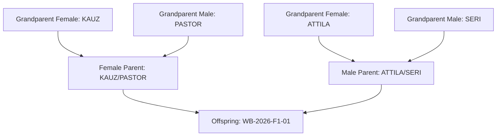

# Chapter 02: Germplasm & Pedigree Management

The **Germplasm Catalog** is the foundation of the breeding platform. It maintains complete traceability of every botanical line, parentage tree, generation stage, and characteristic tag.

---

## 1. Germplasm Data Model & Key Attributes

Every accession registered in the platform possesses:
- **Name**: Unique name or breeding code (e.g. `WB-2026-F5-042`, `KAUZ`, `PASTOR`).
- **Germplasm DB ID**: Global unique accession ID automatically generated (e.g. `G000142`).
- **Species**: Taxonomic designation (default: `Triticum aestivum` hexaploid bread wheat, or `Triticum durum`).
- **Program**: Breeding program owner (e.g. *Spring Wheat Breeding Program*).
- **Female Parent (Seed Parent)**: Link to the female accession (`parent_female`).
- **Male Parent (Pollen Parent)**: Link to the male accession (`parent_male`).
- **Pedigree String**: Standard Purdy / CIMMYT pedigree notation string (e.g. `KAUZ/PASTOR//ATTILA`).
- **Cross Type**: Classification of origin:
  - `biparental`: Direct single cross between two parent lines.
  - `self`: Inbreeding / self-pollination generation.
  - `backcross`: Recurrent backcross to donor parent.
  - `doubled_haploid`: Rapidly homozygosed doubled haploid line ($DH$).
  - `other` / `unknown`.
- **Generation Index**: Numeric inbreeding generation:
  - $0 = F_0$ (immediate cross product)
  - $1 = F_1$, $2 = F_2$, $3 = F_3$, ..., $8 = F_8+$ (fixed homozygous line)
- **Check Status (`is_check`)**: Boolean flag designating permanent commercial or local checks (e.g. `SIRIUS-CHECK`, `BORLAUG100`). Check lines receive distinct badges throughout trial layouts and analysis.
- **Tags**: JSON tags for grouping and filtering (e.g. `["drought-tolerant", "rust-resistant", "release-candidate"]`).

---

## 2. Pedigree Trees & Ancestry Visualization

The platform recursively traces female and male parentage to build interactive pedigree trees:



### Navigating Pedigree Trees in UI
1. Go to the **🌱 Germplasm** page.
2. Select any accession in the table or card grid.
3. Click the **🌳 Pedigree Tree** tab in the inspection drawer.
4. Expand maternal and paternal branches to inspect grandparents, great-grandparents, and generation history.

---

## 3. Bulk CSV / Excel Germplasm Import

To import hundreds or thousands of accessions at once:

### Standard CSV Format
```csv
name,species,cross_type,pedigree_string,generation,year_developed,is_check,tags
KAUZ,Triticum aestivum,unknown,KAUZ,8,2018,true,drought-tolerant;check
WB-F3-001,Triticum aestivum,biparental,KAUZ/PASTOR,3,2026,false,pre-yield
WB-F3-002,Triticum aestivum,biparental,KAUZ/PASTOR,3,2026,false,pre-yield
```

### Steps to Import
1. Navigate to **🌱 Germplasm** and click **📤 Bulk Import CSV**.
2. Select your breeding program.
3. Choose your CSV file. The preview modal displays column mappings and validates syntax.
4. Click **Confirm Import**. The system creates accessions in an atomic transaction and reports successful rows.

---

## 4. Side-by-Side Line Comparison

1. In the **🌱 Germplasm** browser, select between 2 and 4 accessions using the selection checkboxes.
2. Click **⚖️ Compare Selected** from the floating bulk actions bar.
3. The comparison modal presents a side-by-side breakdown of parentage, generation stage, breeding tags, seed stock availability, and historical trial performance metrics.

---

## 5. Next Steps

Proceed to [Chapter 03: Crossing Blocks & Diallel Matrices](file:///c:/wheat-breeding-platform/docs/wiki/03_CROSSING_BLOCKS.md) to learn how to plan crosses and track pollination.
