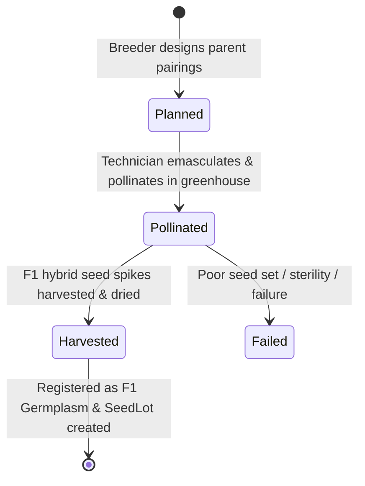

# Chapter 03: Crossing Blocks & Diallel Matrices

The **Crossing Block** module streamlines hybridizations, parent pairing, diallel crossing schemes, and pollination lifecycle tracking in greenhouses and crossing nurseries.

---

## 1. Crossing Block Lifecycle

Each crossing plan progresses through four standardized stages:



1. **Planned**: Crosses designed between female (seed) and male (pollen) parents with target objectives.
2. **Pollinated**: Spikes successfully emasculated and dusted with pollen; pollination date and technician logged.
3. **Harvested**: Mature $F_1$ seed spikes harvested, seed count or grain weight recorded, and automatically registered into **🌱 Germplasm** and **📦 Seed Inventory**.
4. **Failed**: Cross aborted due to lodging, disease, desynchronized flowering, or zero seed set.

---

## 2. Diallel Cross Matrix Heatmap

When evaluating combining abilities across a panel of parental lines (e.g. 10 elite lines), the **Diallel Matrix Visualizer** generates an $N \times N$ interactive grid:

```
           Parent 1    Parent 2    Parent 3    Parent 4
Parent 1   [ Self ]    [Planned]   [Harvest]   [Planned]
Parent 2   [Recipr]    [ Self ]    [Pollin.]   [Harvest]
Parent 3   [Recipr]    [Recipr]    [ Self ]    [Planned]
Parent 4   [Recipr]    [Recipr]    [Recipr]    [ Self ]
```

### Features:
- **Color-Coded Status Cells**:
  - 🟡 **Yellow**: Planned (pending pollination).
  - 🔵 **Blue**: Pollinated (ripening on plant).
  - 🟢 **Green**: Harvested ($F_1$ seed secured).
  - 🔴 **Red**: Failed cross.
- **One-Click Cross Initiation**: Click any empty cell in the matrix to immediately instantiate a planned cross between that female and male line.
- **Auto-Generate Reciprocals**: Toggle "Include Reciprocals" to automatically schedule reverse parent pairings ($B \times A$ alongside $A \times B$) to study maternal / cytoplasmic effects.

---

## 3. Nursery Sowing Maps for Crossing

To prevent flowering desynchronization between early-maturing and late-maturing wheat parents, the crossing block provides staggered sowing layout patterns:
- **Common Male First**: Male pollen donors sown in repeated border blocks with multiple sowing dates.
- **Common Female First**: Seed parents arranged in central beds with pollen parents rotated around them.
- **Alternating Male / Female**: Alternating pot or row arrangements for paired crossing.

---

## 4. Advancing Harvested $F_1$ Seed

When a cross reaches **Harvested** status:
1. The platform automatically creates a new `Germplasm` record with `cross_type="biparental"`, `generation=1` ($F_1$), and generates the Purdy pedigree string `Female/Male`.
2. A corresponding `SeedLot` is created in **📦 Seed Inventory** ready for the subsequent $F_2$ space-planted nursery or speed-breeding chamber.

---

## 5. Next Steps

Proceed to [Chapter 04: Seed Inventory & Storage Logistics](file:///c:/wheat-breeding-platform/docs/wiki/04_SEED_INVENTORY.md) to manage seed storage, inventory transactions, and barcode labels.
