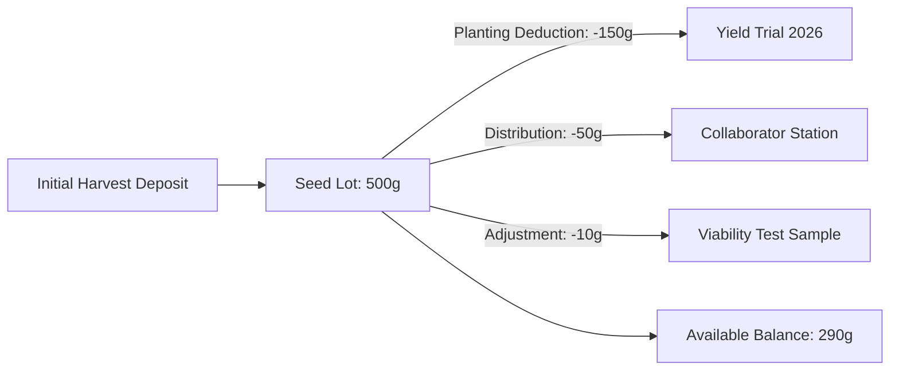

# Chapter 04: Seed Inventory & Storage Logistics

The **Seed Inventory** module maintains precision accountability of physical seed packets, storage vaults, inventory deductions for field trials, viability alerts, and barcode labeling.

---

## 1. Seed Lot Structure & Storage Locations

Every physical seed lot (`SeedLot`) records:
- **Lot Number**: Unique identifier (e.g. `LOT-2026-00452`).
- **Germplasm Link**: Accession to which the seed belongs.
- **Current Quantity (grams)**: Available physical mass of seed.
- **Reserved Quantity (grams)**: Seed allocated to planned trials or crossing sessions.
- **Storage Location**: Physical storage hierarchy:
  - *Cold Room 1 (4°C) — Shelf B4 — Box 12*
  - *Long-Term Vault (-20°C) — Rack 3 — Tray 08*
  - *Greenhouse Prep Cabinet — Bin A*
- **Germination / Viability Rate (%)**: Last tested germination percentage (e.g. 96%).
- **Viability Test Date**: Date of latest standard blotter or roll test.

---

## 2. Inventory Transaction Ledger

Seed movements are recorded in an immutable ledger (`SeedTransaction`):

### Transaction Types:
1. `initial_deposit`: First entry upon harvest or seed receipt.
2. `harvest_deposit`: Addition of newly harvested seed from multiplication plots.
3. `planting_deduction`: Subtraction of seed packaged for field trials.
4. `distribution`: Transfer to external collaborators or genebanks.
5. `adjustment`: Inventory reconciliation following manual tare weight checks.

---

## 3. Lot Splitting & Sub-Lot Operations

When sending seed to multiple locations or separating research stock from commercial seed increases:
1. In the **📦 Seed Inventory** table, click on any lot and select **✂️ Split Lot**.
2. Specify the quantity to transfer into the new sub-lot (e.g. 100 grams).
3. Assign the new storage location.
4. The system automatically creates `LOT-xxxx-B`, updates the parent lot balance, and logs paired ledger transactions.

---

## 4. Viability & Expiration Monitoring

The inventory dashboard flags seed aging:
- 🟢 **High Viability (>85%)**: Certified for precision machine planting.
- 🟡 **Moderate Viability (70–85%)**: Requires increased seeding rate / sowing density adjustment.
- 🔴 **Low Viability (<70%) or >3 Years Untested**: Flagged with automatic alert banner for urgent seed multiplication or re-testing.

---

## 5. Barcode Label Printing Sheet

To generate physical QR/barcode labels for seed packets and envelopes:
1. Select one or multiple seed lots in the inventory table.
2. Click **🏷️ Print Barcode Labels**.
3. Choose your label sheet template (e.g. standard 24-up or 30-up Avery sheets).
4. The system renders printable vector barcode sheets displaying:
   - Germplasm Name & DB ID
   - Lot Number & Year
   - QR Code / Barcode (scannable via mobile camera or Bluetooth barcode wand)
   - Storage Location

---

## 6. Next Steps

Proceed to [Chapter 05: Trial Management & Experimental Designs](file:///c:/wheat-breeding-platform/docs/wiki/05_TRIAL_MANAGEMENT_AND_LAYOUTS.md) to learn how trials are designed, randomized, and mapped.
