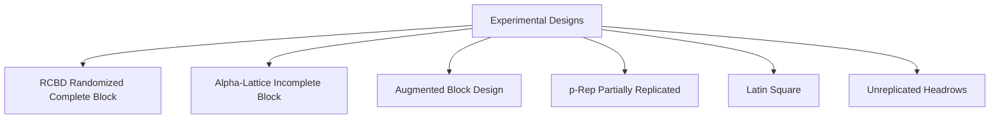

# Chapter 05: Trial Management & Experimental Layouts

The **Trial Manager** handles the full operational lifecycle of field experiments, statistical design generation, spatial plot coordinate mapping, and advancement selections.

---

## 1. Experimental Design Generators

The platform includes built-in statistical randomization engines:

### Supported Design Types:
1. **RCBD (Randomized Complete Block Design)**:
   - Every entry replicated across all complete blocks (replications).
   - Standard for advanced yield trials ($AYT$, $EYT$) with moderate entry counts (10–50 lines).
2. **Alpha-Lattice Design ($\alpha$-lattice)**:
   - High-efficiency incomplete block design for large entry counts (50–500 lines).
   - Requires entry count $N$ divisible by incomplete block size $k$ ($N = k \times s$).
   - Reduces spatial soil heterogeneity variance.
3. **Augmented Block Design (Federer Augmented)**:
   - Designed for early-generation testing ($F_3, F_4, F_5$) with limited seed.
   - Test entries sown once (unreplicated); standard check lines replicated systematically across every block.
   - Adjusts unreplicated test entry phenotypes based on local check performance.
4. **p-Rep (Partially Replicated Design)**:
   - A fraction of test entries (e.g. 20–30%) replicated twice; checks replicated across all blocks.
   - Maximizes test entry capacity while estimating environmental error variance.
5. **Latin Square**:
   - Two-directional blocking (Rows and Columns) for greenhouse bench experiments or directional slope field gradients.
6. **Unreplicated / Single Headrows**:
   - Single-plot headrow nurseries.

---

## 2. Spatial Serpentine Coordinate Generation

The platform automatically computes 2D field grid coordinates $(Row, Column)$ for every plot to mirror tractor sowing and harvester navigation:

- **Horizontal Serpentine (`h_serpentine`)**: Sows Row 1 West $\to$ East, turns and sows Row 2 East $\to$ West.
- **Vertical Serpentine (`v_serpentine`)**: Sows Col 1 North $\to$ South, turns and sows Col 2 South $\to$ North.
- **Cartesian (`h_cartesian`, `v_cartesian`)**: Unidirectional sowing with turnaround return.
- **Starting Corner**: Bottom-Left (`BL`), Bottom-Right (`BR`), Top-Left (`TL`), Top-Right (`TR`).

---

## 3. Interactive Map Wizard & Plot Inspector

Within the **⊞ Trials** module:

### Map Features:
1. **Interactive Plot Grid**: Displays the physical field layout with exact plot numbers, range/row coordinates, and germplasm names.
2. **Color-by Selector**:
   - Color by *Replication* (Rep 1, Rep 2, Rep 3).
   - Color by *Entry Type* (Checks in bright amber, Test entries in emerald green).
   - Color by *Trait Phenotype* (Live heat map of plant height, grain yield, or disease severity).
3. **Click-to-Inspect Popover**: Click any plot to view parentage, seed lot source, and real-time observation history.
4. **Print Layout Mode**: Generates high-resolution printable field plot maps for field clipboards.

---

## 4. Advancing Selections to Next Generation

At harvest, select superior performing plots to create new generation germplasm:
1. Open the trial detail view and go to the **Selections / Advance Plots** tab.
2. Filter plots by selection threshold criteria (e.g. `Yield > 6.5 t/ha` and `Lodging < 2`).
3. Select advancement method:
   - `SSD` (Single Seed Descent)
   - `Single Spike` (Head selection)
   - `Single Plant` ($SP$)
   - `Special Bulk` ($SB$)
4. Click **Advance Selected Plots**. The platform automatically creates progeny records in **🌱 Germplasm** with incremented generation indices ($F_n \to F_{n+1}$) and clean pedigree suffixes (e.g. `-F5-SSD`).

---

## 5. Next Steps

Proceed to [Chapter 06: Phenotyping, Scoring & Offline PWA](file:///c:/wheat-breeding-platform/docs/wiki/06_PHENOTYPING_AND_OFFLINE_PWA.md) to learn how field observations and mobile scorings are recorded.
