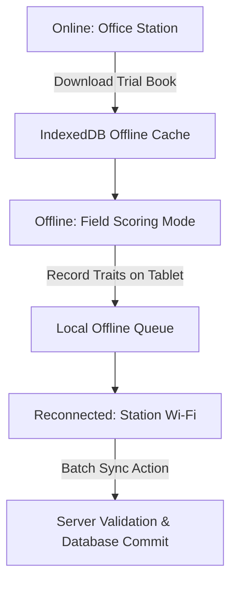

# Chapter 06: Phenotyping, Scoring & Offline PWA

The **Phenotyping & Scoring** module provides high-speed data capture across desktop workstations and field tablets without requiring an active internet connection.

---

## 1. Trait Library & Custom Trait Panels

Traits (`ObservationVariable`) define standard phenotypic measurements:
- **Categories**:
  - `agronomic`: Grain Yield, Plant Height, Days to Heading, Lodging Score.
  - `disease`: Stripe Rust, Leaf Rust, Fusarium Head Blight, Septoria Tritici Blotch.
  - `quality`: Grain Protein Content, Test Weight ($kg/hL$), Hardness Index, Gluten Strength ($W$).
  - `phenology`: Emergence Date, Anthesis Date, Physiological Maturity.
  - `morphological`: Spike Density, Awn Presence, Glume Color.
  - `abiotic`: Drought Susceptibility Index, Canopy Temperature Depression, Salt Tolerance.
- **Data Types**: `numeric` (continuous float), `integer` (discrete counts), `categorical` (1–9 scales or text choices), `date`, `text`.
- **Validation Rules**: Configurable `min_value` and `max_value` preventing erroneous field entries (e.g. Height $> 250\text{ cm}$ blocked).

### Trait Panels:
Create reusable groupings of traits for specific scoring events (e.g. *"Early Season Agronomy Panel"* or *"Post-Harvest Grain Quality Panel"*) to unclutter field scoring screens.

---

## 2. Desktop Observation Scoring Modes

### 1. Single Plot Detail Mode
- Navigate through plots sequentially via keyboard arrows (`Enter` / `Tab`).
- Displays immediate historical check averages and inline validation errors.

### 2. High-Speed Spreadsheet Grid Mode
- Renders an Excel-like interactive grid where Rows = Plots and Columns = Traits.
- Supports copy-paste directly from Excel.
- Whole-batch transactional save with cell-by-cell error highlights.

---

## 3. Offline-First PWA Field Scoring App 📱

When scoring in remote experimental stations with zero cellular network or Wi-Fi:

### How to Use Offline Field Mode:
1. **Before Heading to Field**:
   - Open the platform in Google Chrome, Safari, or Edge on your mobile tablet.
   - Click **Install WheatBreed PWA** (or Add to Home Screen).
   - Navigate to the target trial and click **📥 Cache Trial for Offline Scoring**.
2. **In the Field (Offline)**:
   - Walk plots according to the serpentine walking order.
   - Enter trait scores via large touch-friendly numpads or dropdown chips.
   - Changes are safely stored in browser `IndexedDB` with cryptographic timestamps.
3. **Returning to Station**:
   - The top header **Offline Sync Badge** glows green indicating cached records ready for sync.
   - Click **Sync Center $\to$ Upload Pending Observations**.
   - The server validates all constraints and confirms synchronized plots.

---

## 4. Next Steps

Proceed to [Chapter 07: Multi-Environment Trials & Heritability](file:///c:/wheat-breeding-platform/docs/wiki/07_MULTI_ENVIRONMENT_ANALYSIS.md) to learn how phenotypic data across trials is jointly analyzed using mixed models.
