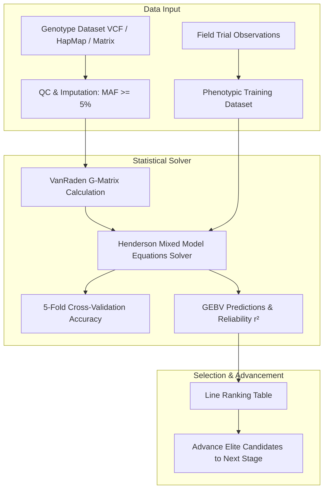

# Chapter 08: Genomic Selection & Diagnostic MAS

The **Genomics & Marker-Assisted Selection (MAS)** module integrates high-density genome-wide SNP panels and functional diagnostic markers into the breeding decision pipeline.

---

## 1. Genomic Prediction & GBLUP Architecture

Genomic Selection (GS) uses genome-wide markers to predict **Genomic Estimated Breeding Values (GEBVs)** for selection candidate lines that have been genotyped but never evaluated in expensive multi-environment field trials.

---

## 2. Ingesting Genotype Datasets

The platform supports 3 standard formats:
1. **Variant Call Format (`.vcf`)**: Standard raw SNP output from GBS, targeted sequencing, or whole-genome sequencing.
2. **HapMap (`.hmp.txt`)**: Standard format used by TASSEL and global wheat genomics consortia.
3. **Numeric Dosage Matrix (`.csv` / `.tsv`)**: Dosage table with entries $0$ (Homozygous Ref), $1$ (Heterozygous), and $2$ (Homozygous Alt).

### Automated QC & Imputation Pipeline:
- **MAF Threshold**: Filters out low-information markers (default: $MAF < 5\%$).
- **Missingness Filter**: Drops markers and samples with $>30\%$ missing calls.
- **Imputation**: Imputes remaining missing calls using mean allele frequency dosage ($2p_j$) or mode genotype.

---

## 3. VanRaden Genomic Relationship Matrix ($G$-Matrix)

Calculates the realized identity-by-state genomic kinship matrix according to VanRaden (2008) Method 1:

$$G = \frac{(M - 2P)(M - 2P)^T}{2 \sum_{j=1}^m p_j (1 - p_j)}$$

with shrinkage regularization $G_{\text{reg}} = (1 - \lambda) G + \lambda I$ ($\lambda = 0.01$) ensuring positive definiteness for matrix inversion.

### Visualizing Genetic Diversity:
- **2D PCA Kinship Plot**: Decomposes the $G$-matrix via principal components ($PC1$ vs $PC2$) to visualize population structure, heterotic groups, and genetic clusters.
- **Kinship Heatmap**: Interactive color grid displaying pairwise kinship coefficients ($G_{ij}$) between lines.

---

## 4. Henderson Mixed Model Equations (GBLUP)

The model solves Henderson's Mixed Model Equations (MME):

$$\begin{bmatrix} X^T X & X^T Z_{\text{train}} \\ Z_{\text{train}}^T X & Z_{\text{train}}^T Z_{\text{train}} + \frac{\sigma^2_e}{\sigma^2_g} G^{-1} \end{bmatrix} \begin{bmatrix} \hat{\mu} \\ \hat{u} \end{bmatrix} = \begin{bmatrix} X^T y \\ Z_{\text{train}}^T y \end{bmatrix}$$

- $\hat{\mu}$: Fixed population mean.
- $\hat{u}$: Vector of GEBVs calculated for **ALL** genotyped lines (both the training lines with field observations and unphenotyped candidate lines).
- **Prediction Reliability ($r^2$)**: Calculated per line from the Prediction Error Variance ($\text{PEV}_i$):
  $$r^2_i = 1 - \frac{\text{PEV}_i}{G_{ii} \sigma^2_g}$$

---

## 5. Diagnostic Wheat Markers & MAS Trait Stacking

Marker-Assisted Selection (MAS) targets major genes with qualitative or large-effect phenotypes.

### Default Wheat Functional Markers Library:
1. **`csLV34` (Lr34 / Yr18 / Sr57 / Pm38)** — 7DS: Durable adult plant multi-pathogen rust resistance.
2. **`Fhb1-SNP` (TaHRC)** — 3BS: Major resistance against Fusarium Head Blight spread.
3. **`Rht-B1_SNP` (Rht1)** — 4BS: Gibberellin-insensitive semi-dwarfing height allele.
4. **`Rht-D1_SNP` (Rht2)** — 4DS: Alternative GA-insensitive semi-dwarfing height allele.
5. **`Ppd-D1_KASP`** — 2DS: Photoperiod insensitivity promoting early flowering and drought escape.
6. **`Gpc-B1_KASP` (NAM-B1)** — 6BS: Accelerates grain protein content and zinc/iron remobilization.
7. **`Sr2_KASP`** — 1BL: Durable stem rust adult plant resistance.
8. **`Glu-D1_5+10`** — 1DL: High-molecular-weight glutenin subunit pair for superior bread-baking dough strength.

### MAS Trait Stacking Matrix:
- Displays an interactive Lines $\times$ Markers heatmap.
- **Favorable Allele Stacking Index (0–100%)**: Quantifies the accumulation of desired functional alleles per accession to pinpoint ideal donor parents for crossing blocks.

---

## 6. Next Steps

Proceed to [Chapter 09: Data Exchange & BrAPI v2 Integration](file:///c:/wheat-breeding-platform/docs/wiki/09_DATA_EXCHANGE_AND_BRAPI.md) to learn how to export datasets and connect external breeding tools.
